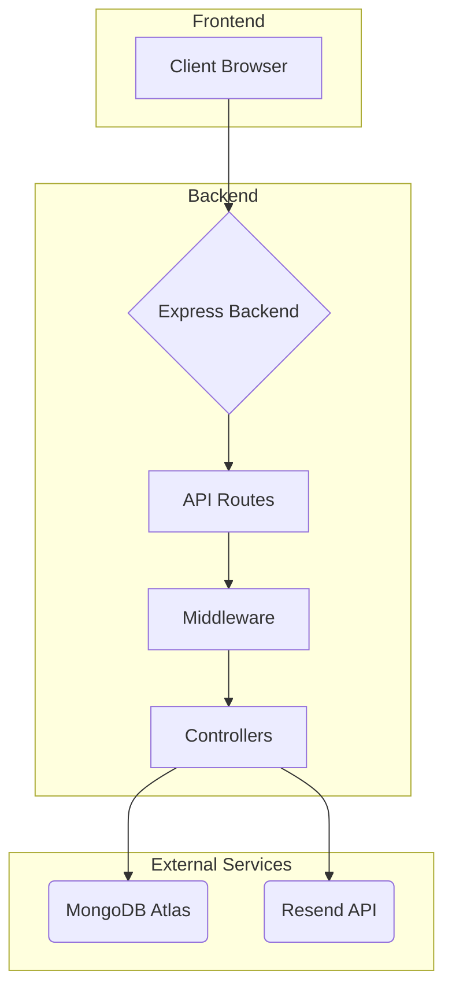
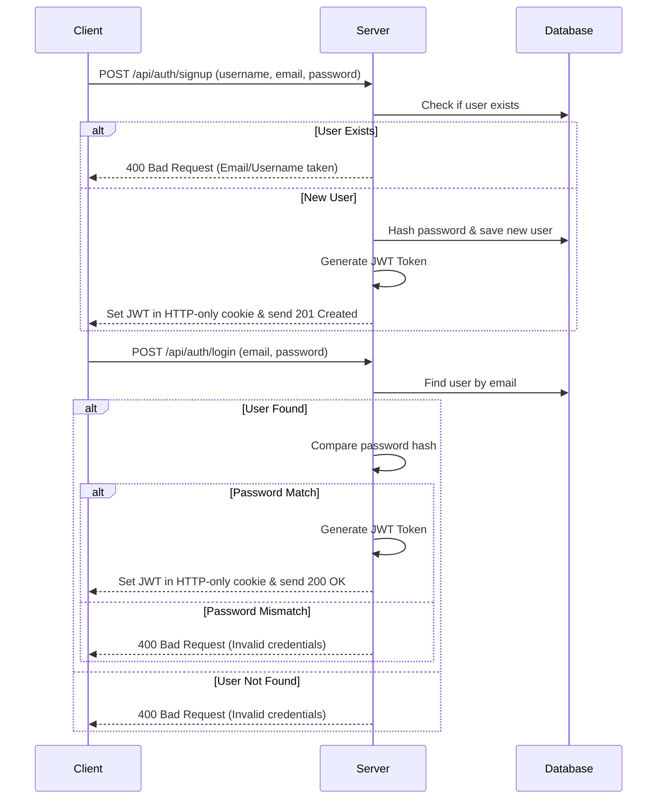

# ChatX Project Documentation

This document provides a comprehensive overview of the ChatX application, including its architecture, features, API endpoints, and development history.

## 1. System Architecture

The project is a full-stack MERN-like application with a React/Vite frontend and a Node.js/Express backend.

### High-Level Flow

### User Authentication Flow

## 2. API Endpoints

All endpoints are prefixed with `/api`.

| Method | Endpoint                | Protection | Description                                                                 |
| :----- | :---------------------- | :--------- | :-------------------------------------------------------------------------- |
| `POST` | `/auth/signup`          | None       | Registers a new user, hashes their password, and sends a welcome email.     |
| `POST` | `/auth/login`           | None       | Authenticates a user and returns a JWT cookie for session management.       |
| `POST` | `/auth/logout`          | None       | Clears the JWT cookie to log the user out.                                  |
| `GET`  | `/auth/me`              | JWT Cookie | Retrieves the profile of the currently authenticated user.                    |
| `PUT`  | `/auth/update-profile`  | JWT Cookie | Updates the profile information for the currently authenticated user.       |
| `GET`  | `/messages/:id`         | JWT Cookie | (Assumed) Gets messages for a specific conversation.                        |
| `POST` | `/messages/send/:id`    | JWT Cookie | (Assumed) Sends a message to a specific user.                               |

## 3. Feature Summary

- **User Authentication**: Secure user signup, login, and logout.
- **Password Hashing**: Passwords are securely hashed using `bcryptjs` before being stored.
- **Session Management**: Uses JWT (JSON Web Tokens) stored in secure, HTTP-only cookies.
- **Protected Routes**: Middleware (`protect`) guards specific endpoints, allowing access only to authenticated users.
- **Profile Updates**: Authenticated users can update their profile information.
- **Welcome Emails**: New users receive a welcome email upon successful registration via the Resend API.
- **Production Build**: The Express server is configured to serve the static frontend build in a production environment.
- **Input Validation**: The signup endpoint includes validation for required fields, password length, and email format.

## 4. Development & Branch History

The project has been developed across several feature branches, each focusing on a specific piece of functionality.

- **`signup`**:
  - **Purpose**: Implemented the initial user registration logic.
  - **Changes**: Created the `User` model, the `signup` controller, and the `/api/auth/signup` route.

- **`welcome-mail`**:
  - **Purpose**: Integrated an email service to welcome new users.
  - **Changes**: Added the `resend` package, created `emailHandlers.js` and `emailTemplates.js`, and integrated the `sendWelcomeEmail` function into the signup flow.

- **`login-and-logout-funtions`**:
  - **Purpose**: Added core authentication and session management features.
  - **Changes**: Implemented the `login` and `logout` controllers, created the `protect` middleware to secure routes, and added the `/api/auth/me` endpoint.

- **`update-profile`**:
  - **Purpose**: Allowed users to modify their own profile.
  - **Changes**: Created the `updateProfile` controller and the protected `/api/auth/update-profile` route.

- **`main`**:
  - **Purpose**: The primary integration branch where all completed features are merged.

## 5. Troubleshooting Log

Throughout the development process, we identified and resolved several key issues:

| Error                                                        | Cause                                                              | Resolution                                                                                             |
| :----------------------------------------------------------- | :----------------------------------------------------------------- | :----------------------------------------------------------------------------------------------------- |
| `PathError: Missing parameter name`                          | `path-to-regexp` (Express dependency) had breaking changes.        | Used a regular expression `(/^(?!\/api).*/) ` for the catch-all route instead of `'*'`.                 |
| `EBADENGINE: Unsupported engine`                             | The Node.js version used (`v18`) was older than required (`v20+`).   | Recommended using a version manager (`nvm`) to switch to a compatible Node.js version.                 |
| `Error: Cannot find module` (e.g., `bcryptjs`, `mongodb`)    | Dependencies were missing or the `node_modules` folder was corrupt.  | Installed the missing package (`npm install bcryptjs`) or performed a clean install (`rm -rf node_modules && npm install`). |
| `ERR_INVALID_MODULE_SPECIFIER`                               | An import path was malformed (e.g., `".lib/utils.js"`).            | Corrected the relative path to `../lib/utils.js`.                                                      |
| `ReferenceError: ... is not defined` (e.g., `updateProfile`) | A controller or function was used in a route without being imported. | Added the missing function to the import statement at the top of the route file.                       |
| `TypeError: Cannot read properties of undefined (reading 'jwt')` | `req.cookies` was undefined because cookies were not being parsed. | Installed the `cookie-parser` package and added it as middleware to the Express app.                 |
| Silent Email Failure                                         | The `sendWelcomeEmail` call was not `await`ed and had an empty `catch` block. | Added `await` to the function call and added error logging/throwing to the `catch` block.            |
| Merge Conflicts                                              | Files were modified on both `main` and a feature branch.           | Guided on how to resolve conflicts manually in VS Code and complete the merge.                         |
| `node_modules` in Git Commits                                | The `node_modules` folder was not being ignored by Git.            | Created a `.gitignore` file and ran `git rm -r --cached node_modules` to untrack the folder.           |

